# MANUAL DE USUARIO

   

#

## Inicio de sesión  

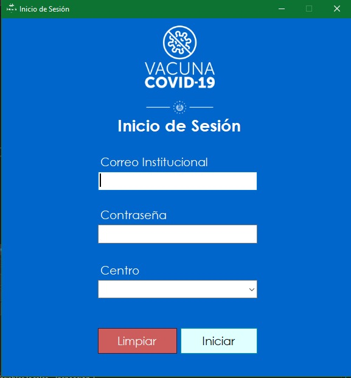

- **Correo institucional:** Campo para correo institucional del empleado.
- **Contraseña:** Campo para contraseña del empleado.
- **Centro de vacunación:** Campo para centro de vacunación asignado.
- **Botón Limpiar:** Botón encargado de limpiar los campos de correo, contraseña y centro de vacunación (puntos 1, 2 y 3).
- **Botón Iniciar sesión:** Botón encargado de iniciar sesión como empleado.
 
 
#

## Menu de Administrador

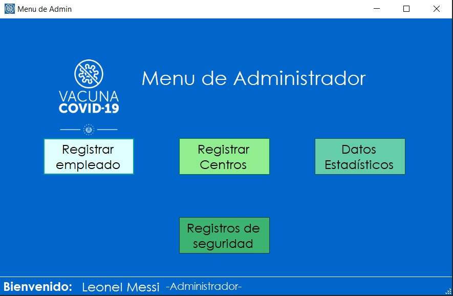

- **Registrar empleado:** Botón encargado de abrir el form registrar empleado.
- **Registrar centros:** Botón encargado de abrir el form registrar centros.
- **Datos estadísticos:** Botón encargado de abrir el form estadísticas.
- **Registros de seguridad:** Botón encargado de abrir el form registros de seguridad.
 
 
#

## Creación de cita

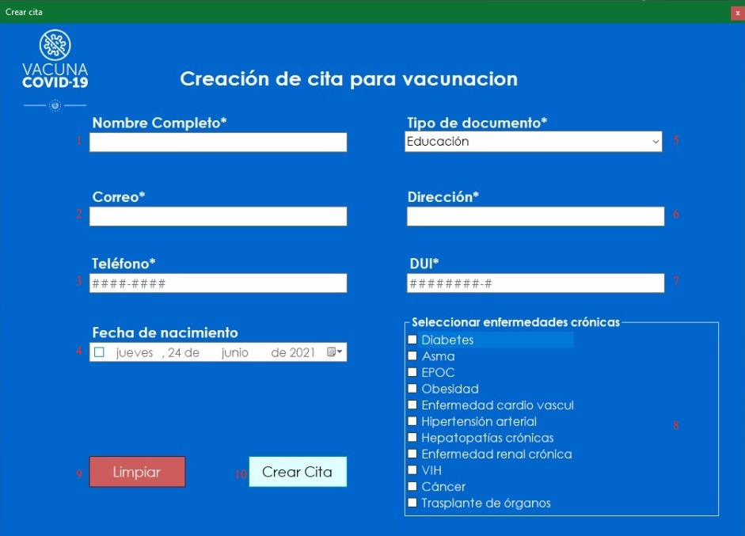

- **Nombre completo:** Campo para nombre completo del paciente.
- **Correo:** Campo para correo electrónico del paciente.
- **Teléfono:** Campo para teléfono del paciente.
- **Fecha de nacimiento:** Campo para fecha de nacimiento del paciente.
- **Tipo de documento:** Campo para tipo de documento del paciente.
- **Dirección:** Campo para dirección del paciente.
- **DUI:** Campo para DUI del paciente.
- **Enfermedades crónicas:** Campo para selección de enfermedades crónicas del paciente.
- **Botón Limpiar:** Botón encargado de limpiar los campos nombre completo, correo, teléfono, fecha de nacimiento, tipo de documento, dirección, DUI y enfermedades crónicas (Puntos 1, 2, 3, 4, 5, 6, 7 y 8).
- **Botón Crear cita:** Botón encargado de la creación de una cita nueva.
 
 
#

## Seguimiento de citas (Citas realizadas)

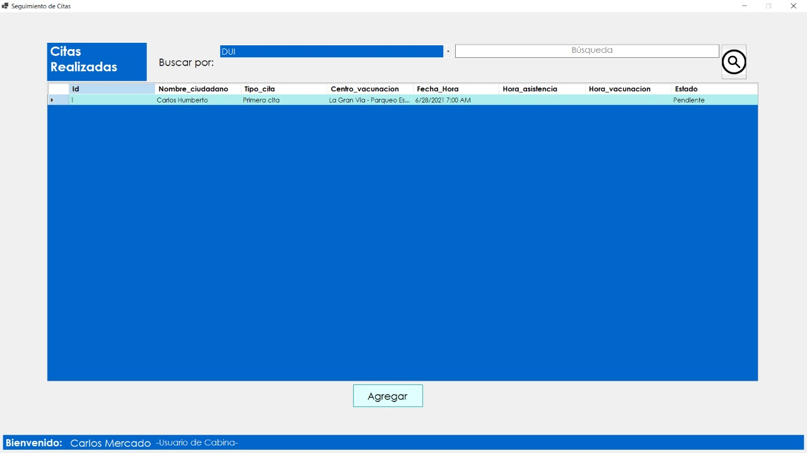

- **Categorías:** Distintas categorías en pagina principal “Seguimiento de citas”.
- **Buscador:** Campo para buscador de citas (Con búsqueda por tipo de dato).
- **Botón buscar:** Botón para buscar una cita en base al campo de buscador (Punto 2).
- **Información mostrada:** DGV enarcado de mostrar la información de las citas almacenadas.
- **Botón Agregar cita:** Botón encargado de agregar una cita nueva (Abre forma Creación de cita).
 
 
#

## Seguimiento de citas (Información de citas)

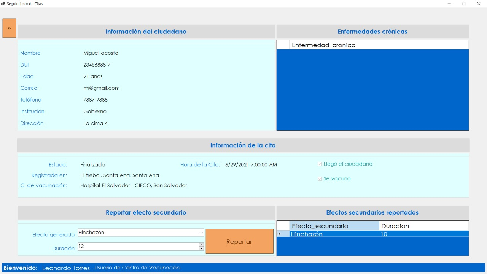

- **Información del ciudadano:** Campo para información del paciente (Nombre, DUI, edad, correo, teléfono, institución y dirección).
- **Enfermedades crónicas:** Campo para enfermedades crónicas del paciente.
- **Información de la cita:** Campo para Información de la cita (Empleado que la registro, cabina en que se registro, hora de la cita y si asistió o no a la cita).
- **Efectos secundarios:** Campo para asignación de efectos secundarios en caso de presentarse alguno.
- **Botón reportar efectos secundarios:** Botón encargado del reporte de efectos secundarios introducidos en el campo efectos secundarios (Punto 4).
 
 
#

## Seguimiento de citas (Imprimir información)

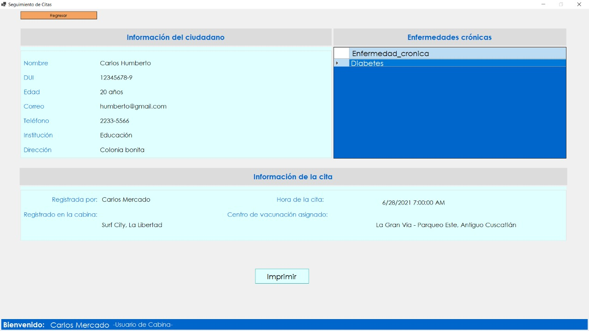

- **Información del ciudadano:** Campo para información del paciente (Nombre, DUI, edad, correo, teléfono, institución y dirección).
- **Enfermedades crónicas:** Campo para enfermedades crónicas del paciente.
- **Información de la cita:** Campo para Información de la cita (Empleado que la registro, cabina en que se registro, hora de la cita y centro de vacunación asignado).
- **Botón imprimir:** Botón encargado de imprimir PDF con la información del ciudadano, enfermedades crónicas e información de la cita (Puntos 1, 2 y 3).
 
 
#

## Ejemplo de PDF impreso

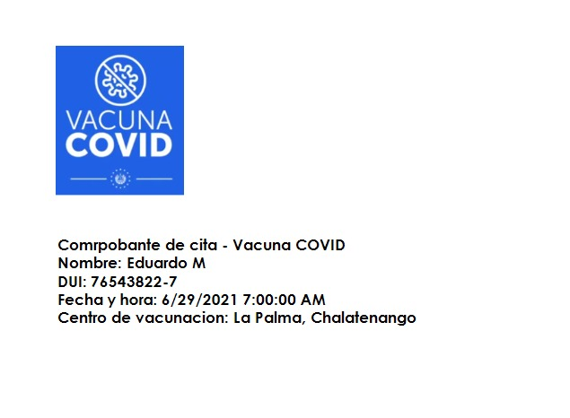

- **Ejemplo PDF:** Muestra el nombre, DUI, fecha y hora en que se programo la cita y el centro de vacunación asignado.
 
 
#

## Registrar empleados

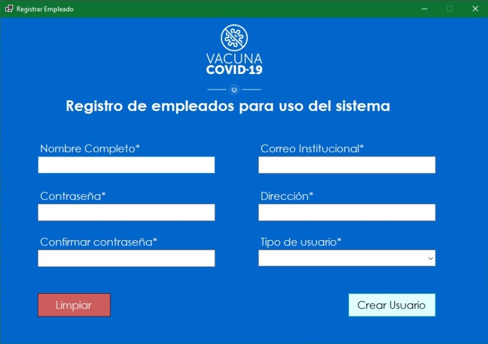

- **Nombre completo:** Campo para nombre completo del empleado.
- **Contraseña:** Campo para contraseña del empleado.
- **Confirmar contraseña:** Campo para repetir contraseña del empleado (Punto 2).
- **Correo institucional:** Campo para correo institucional del empleado.
- **Dirección:** Campo para dirección del empleado.
- **Tipo de usuario:** Campo para tipo de usuario del empleado.
- **Botón Limpiar:** Botón encargado de limpiar los campos nombre completo, contraseña, confirmar contraseña, correo institucional, dirección y tipo de usuario (Puntos 1, 2, 3, 4, 5 y 6).
- **Botón crear usuario:** Botón encargado de crear un nuevo empleado.
 
 
#

## Registrar cabinas

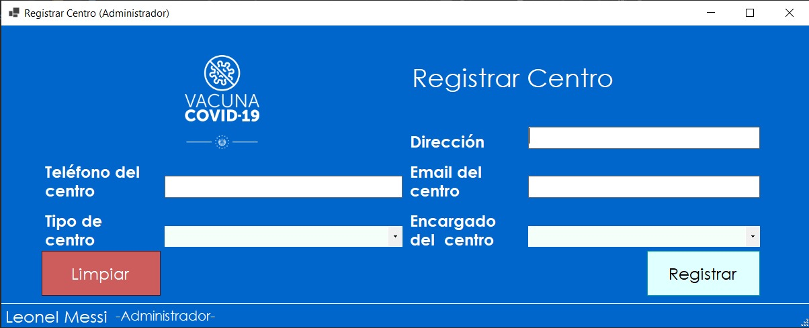

- **Teléfono del centro:** Campo para teléfono del centro de vacunación.
- **Tipo de centro:** Campo para tipo de centro de vacunación.
- **Dirección:** Campo para dirección de centro de vacunación.
- **Email del centro:** Campo para email de centro de vacunación.
- **Encargado del centro:** Campo para nombre del encargado del centro de vacunación.
- **Botón limpiar:** Botón encargado de limpiar los campos teléfono del centro, tipo de centro, dirección, email del centro y encargado del centro (Puntos 1, 2, 3, 4 y 5).
- **Botón registrar:** Botón encargado de crear un nuevo centro.
 
 
#

## Estadísticas 

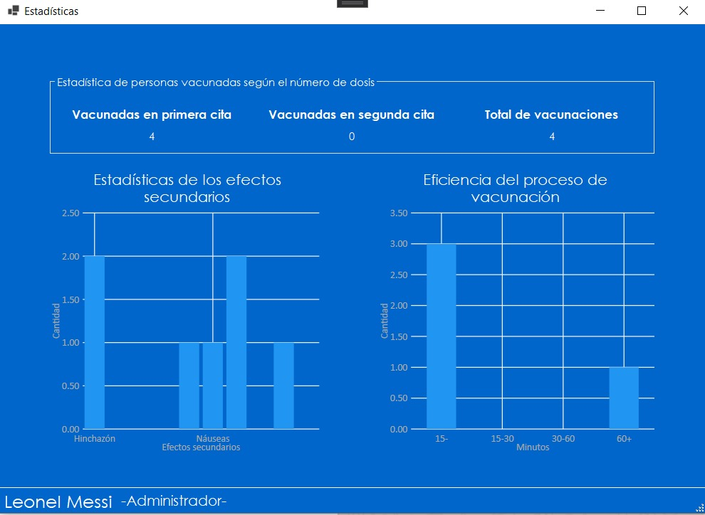

- **Personas vacunadas según el numero de Dosis:** Campo que muestra la cantidad de pacientes que poseen su primera dosis, su segunda dosis, y la dosis total de vacunas puestas.
- **Efectos secundarios:** Grafico con información acerca de los efectos segundarios que las vacunas puedan causar.
- **Eficiencia del proceso de vacunación:** Grafica con información acerca de la eficiencia en el proceso de vacunación, mostrando tiempo y cantidad de dosis.
 
 
#

## Seguridad

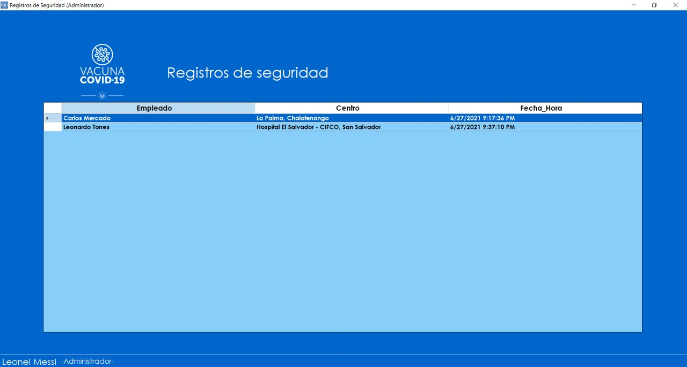

- **Registros de seguridad:** Campo que muestra los registros de seguridad basados en nombre, centro de vacunacion y fecha y hora de acceso del empleado.
